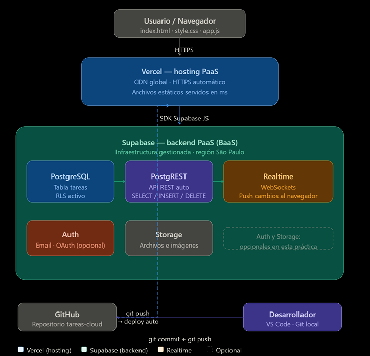
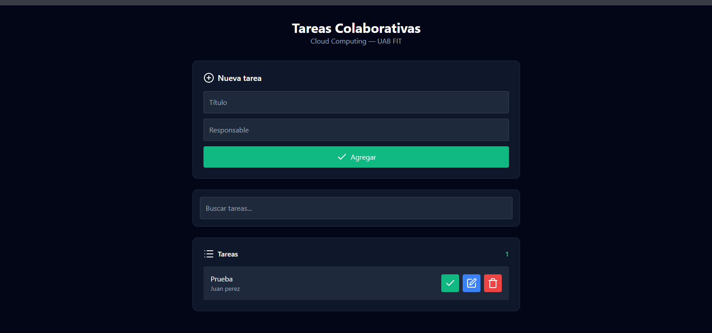
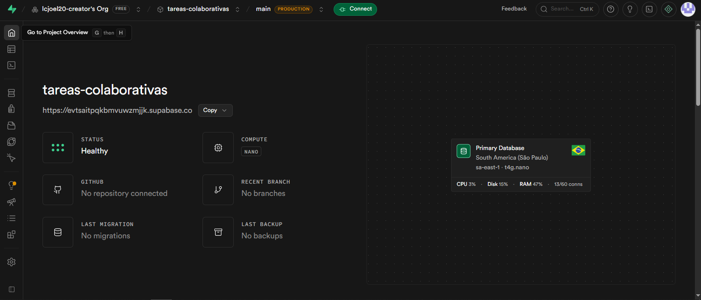
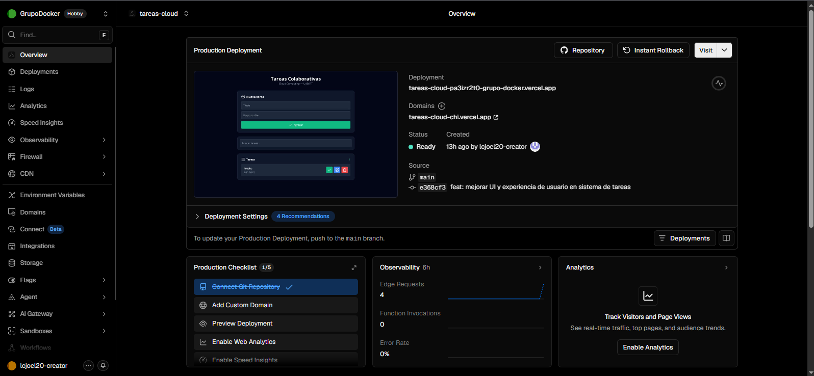

# Sistema de Registro de Tareas Colaborativas en Tiempo Real

## Información General

- **Asignatura:** Tecnologías Emergentes
- **Semestre:** 7mo Semestre – Ingeniería de Sistemas
- **Institución:** UAB FIT
- **Docente:** Ing. Hermes Rodriguez Rivero

---

## Descripción del Proyecto

Este proyecto consiste en un **Sistema de Registro de Tareas Colaborativas en Tiempo Real**, desarrollado para demostrar el uso de tecnologías cloud bajo el modelo **PaaS (Platform as a Service)**.

La aplicación permite que múltiples usuarios gestionen tareas simultáneamente, visualizando los cambios de forma inmediata gracias a la sincronización en tiempo real proporcionada por Supabase.

### Funcionalidades

- Registro de tareas mediante formulario.
- Asignación de responsables.
- Actualización automática en tiempo real.
- Cambio de estado entre **Pendiente** y **Completada**.
- Eliminación de tareas.
- Sincronización instantánea entre múltiples usuarios conectados.

---

## Demo en Producción

La aplicación se encuentra desplegada y disponible en:

**https://tareas-cloud-chi.vercel.app/**

---

## Tecnologías Utilizadas

### Frontend

- HTML5
- CSS3
- JavaScript (Vanilla)

### Backend y Servicios Cloud

- Supabase
  - PostgreSQL
  - Realtime
  - Row Level Security (RLS)

### Despliegue

- Vercel

### Control de Versiones

- Git
- GitHub

---

## Arquitectura Cloud

La solución utiliza una arquitectura basada completamente en servicios gestionados en la nube.

### Vercel

Se encarga del alojamiento de la aplicación web y del despliegue automático desde GitHub mediante integración continua.

### Supabase

Proporciona la base de datos PostgreSQL, las políticas de seguridad y la sincronización en tiempo real mediante WebSockets.

<p align="center">
  
</p>

---

## Configuración e Instalación

### Requisitos Previos

Instalar:

- Node.js 20 LTS
- Git

### Configuración de Supabase

1. Crear un proyecto en Supabase.
2. Abrir el **SQL Editor**.
3. Ejecutar el script de creación de la tabla `tareas`.
4. Configurar las políticas **RLS**.
5. Habilitar **Realtime** para la tabla.
6. Obtener:
   - Project URL
   - anon public key

### Clonar el Repositorio

```bash
git clone https://github.com/lcjoel20-creator/tareas-cloud.git
cd tareas-cloud
```

### Configurar Credenciales

Editar el archivo `app.js`:

```javascript
const SUPABASE_URL = "https://TU_PROYECTO.supabase.co";
const SUPABASE_ANON_KEY = "TU_ANON_KEY_AQUI";
```

---

## Despliegue

El proyecto utiliza integración y despliegue continuo mediante GitHub y Vercel.

### Flujo de Despliegue

1. Realizar cambios en el proyecto.
2. Confirmar cambios con Git.
3. Enviar cambios al repositorio remoto.

```bash
git add .
git commit -m "Actualización del proyecto"
git push
```

4. Vercel detectará automáticamente el nuevo commit y generará una nueva versión en producción.

---

## Capturas de Pantalla

### Interfaz Principal de la Aplicación

Vista principal donde los usuarios pueden registrar, visualizar y administrar tareas colaborativas.

<p align="center">
  
</p>

### Base de Datos y Realtime en Supabase

Configuración y administración de la base de datos PostgreSQL junto con las funcionalidades de sincronización en tiempo real.

<p align="center">
  
</p>

### Despliegue del Proyecto en Vercel

Panel de despliegue y alojamiento de la aplicación en la plataforma Vercel.

<p align="center">
  
</p>
